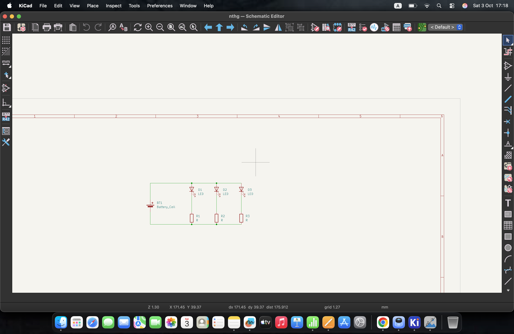
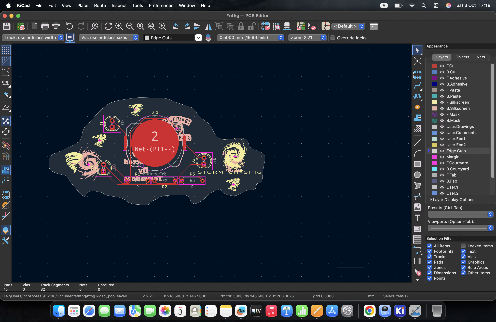
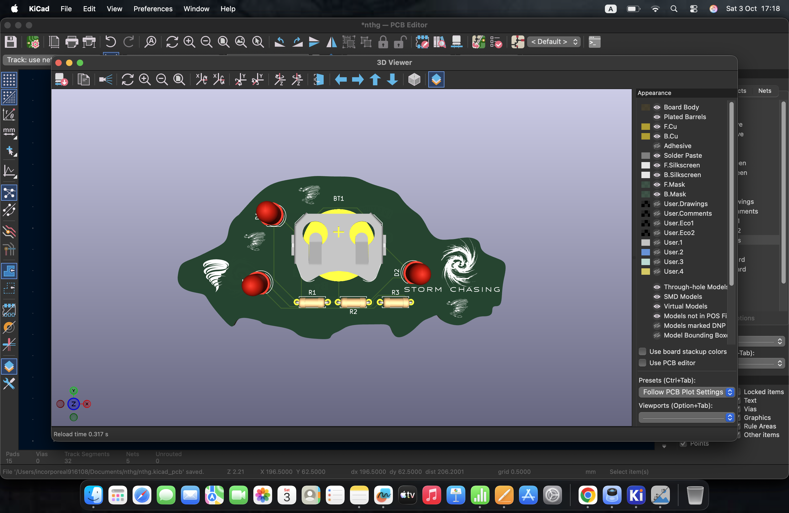

# MY-PCB

## Schematic

## PCB

## How to build
Just order the PCB & components, open up the KiCAD file and build it accordingly.

## BOM
- 1 	Battery holder
- 3 	470 Resistor
- 1 	Push Button
- 3 LEDs

Made by ME

Made as a part of http://solder.hackclub.com/!
